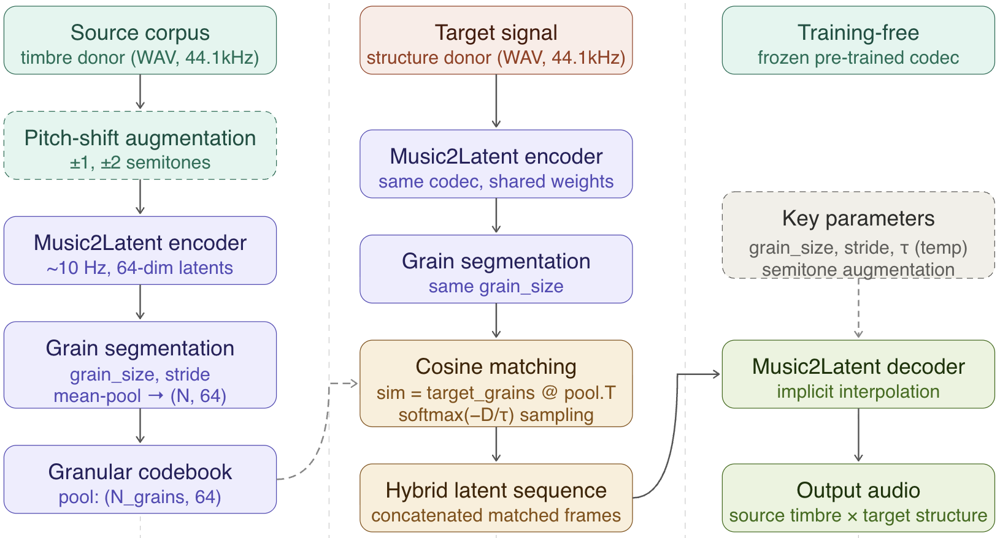

# Temporal Coherence via Viterbi Path Selection in Latent Granular Resynthesis



Extension of *Tokui & Baker, ISMIR 2025* with:
- Viterbi grain path selection for temporal coherence
- Soft latent blending ablation
- Quantitative evaluation (RMS envelope correlation)
- UMAP/PCA latent space visualisation

## Background

The original paper ([Tokui & Baker, ISMIR 2025](https://github.com/naotokui/latentgranular/))
introduces Latent Granular Resynthesis: a training-free method that encodes a source audio corpus
into latent grains via a neural audio codec (Music2Latent), then replaces each latent grain of a
target signal with its closest match from the codebook. This preserves the target's temporal
structure while adopting the source's timbral character.

The baseline matches grains independently (greedy cosine argmax or softmax sampling),
which can produce abrupt timbral jumps between consecutive grains. This extension introduces
a globally optimal grain path via Viterbi decoding, enforcing temporal smoothness while
maintaining timbral similarity.

## Repository structure

```
├── ViterbiLGR.ipynb   Main notebook
├── audioexamples/         Example of generated hybrid audio
├── utils/
│   ├── m2l_utils.py       Codec encode/decode utilities 
│   ├── viterbi_lgr.py     Viterbi grain path selection
│   ├── soft_lgr.py        Soft latent blending ablation
│   └── evaluation.py      Quantitative evaluation metrics
├── wav44k/                Input audio files (44.1 kHz mono WAV)
├── README.md
└── requirements.txt
```

## Quickstart

```bash
pip install -r requirements.txt

# Place your audio files in wav44k/ then open:
jupyter notebook ViterbiLGR.ipynb
```

Run cells in order.

## Key parameters

| Parameter | Location | Description |
|-----------|----------|-------------|
| `GRAIN_SIZE` | Phase 4 | Frames per grain (1≈100ms, 2≈200ms, …) |
| `STRIDE` | Phase 4 | Step between source grains (overlap control) |
| `TEMPERATURE` | Phase 6 | Baseline softmax temperature (0=argmax) |
| `smoothness` λ | Phase 10 | Viterbi transition penalty (0=argmax, ∞=max smoothness) |
| `top_k` | Phase 11 | Number of grains blended in soft mode |

## Algorithm overview

### Baseline
For each target grain independently: `i* = argmax_i cosine_sim(target_grain, pool_grain_i)`

### Viterbi extension
Find the globally optimal path through the codebook:
```
V[t, j] = max_i ( V[t-1, i]  −  λ · D_cos(pool_i, pool_j) )  +  cosine_sim(target_t, pool_j)
```
`λ` (smoothness) interpolates between greedy matching (λ=0) and maximally smooth trajectories.

### Evaluation metrics

- **Structural preservation**: Pearson correlation of RMS energy envelopes (target vs hybrid). ↑ = better structure.

## License

- Code: MIT
- Music2Latent model weights: CC BY-NC 4.0 (non-commercial use only)
